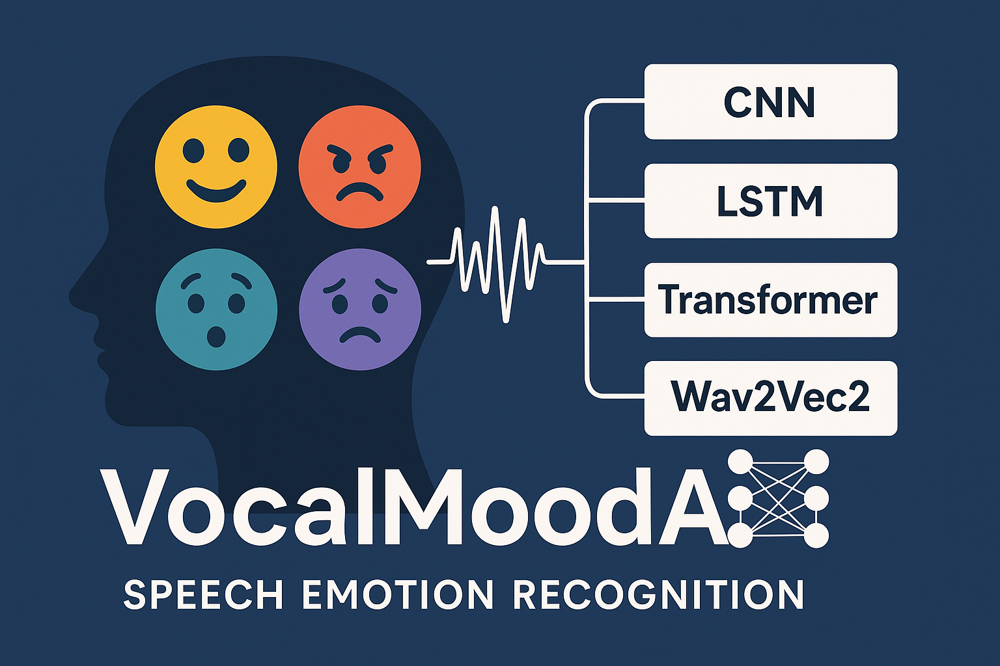

# VocalMoodAI: Multi-Model Speech Emotion Recognition

VocalMoodAI is a comprehensive speech emotion recognition project that implements and compares multiple state-of-the-art approaches using deep learning techniques. This project showcases different architectures including CNNs, LSTMs, Transformers, and the Wav2Vec2 model for real-time emotion detection from speech.

<p align="center">
  
</p>

## Project Structure
```
VocalMoodAI/
├── cnn/
│   └── notebooks/
│       ├── parallel_cnn_attention_lstm.ipynb
│       └── stacked_cnn_attention_lstm.ipynb
├── transformers/
│   └── notebooks/
│       └── speech_emotion_recognition.ipynb
├── wav2vec2/
│   └── notebooks/
│       └── wav2vec2_speech_emotion_recognition.ipynb
└── README.md
```

## Models and Datasets

### 1. CNN-based Models
- **Parallel CNN-Attention-LSTM**
  - Dataset: RAVDESS (Ryerson Audio-Visual Database of Emotional Speech and Song)
  - File: `cnn/notebooks/parallel_cnn_attention_lstm.ipynb`

- **Stacked CNN-Attention-LSTM**
  - Dataset: RAVDESS
  - File: `cnn/notebooks/stacked_cnn_attention_lstm.ipynb`

### 2. Transformer-based Model
- Dataset: IEMOCAP (Interactive Emotional Dyadic Motion Capture Database)
- File: `transformers/notebooks/speech_emotion_recognition.ipynb`

### 3. Wav2Vec2 Model
- Dataset: TESS (Toronto Emotional Speech Set)
- File: `wav2vec2/notebooks/wav2vec2_speech_emotion_recognition.ipynb`

## Key Features

- Multiple model architectures for comparative analysis
- Utilization of various emotional speech datasets
- Implementation using PyTorch and Hugging Face Transformers

## Requirements

- Python 3.7+
- PyTorch
- Transformers (Hugging Face)
- Librosa
- Pandas
- NumPy
- Matplotlib
- torchaudio

## Usage

Each notebook in the respective directories contains the complete pipeline for its corresponding model, including:

1. Data loading and preprocessing
2. Model architecture definition
3. Training process
4. Evaluation metrics
5. Inference examples

To run a specific model, navigate to its notebook and execute all cells sequentially.

## Results

I will try to re-run the code as it's been a long time and attach the results accordingly. And I will add requirements.txt as well I will refine this repository a bit.

Performance metrics and comparisons between different models can be found within each notebook. A comprehensive analysis of all models is provided in the conclusion section of each notebook.

## Future Work

- I will try to re-run the code as it's been a long time and refind some parts of it
- Create an application where the models can be inferred
- Real-time audio input processing for live demonstrations
- Expansion to multi-modal emotion recognition (including visual cues)